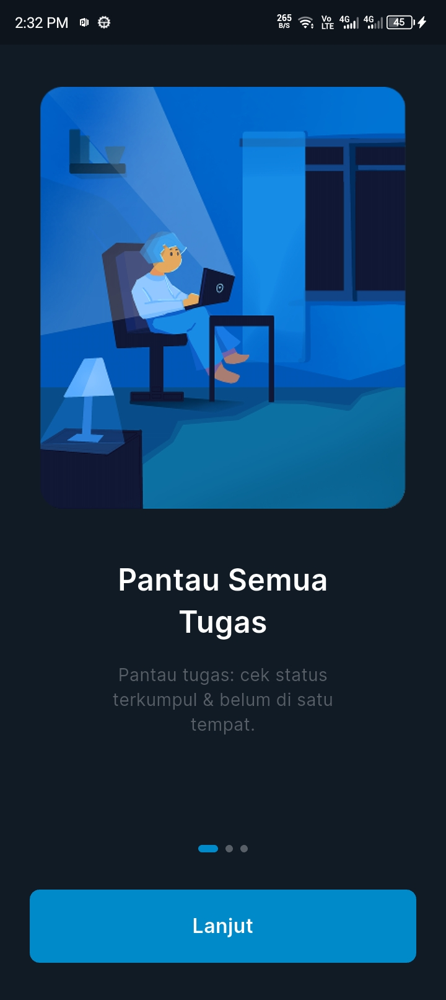
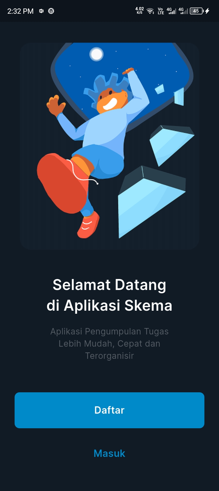
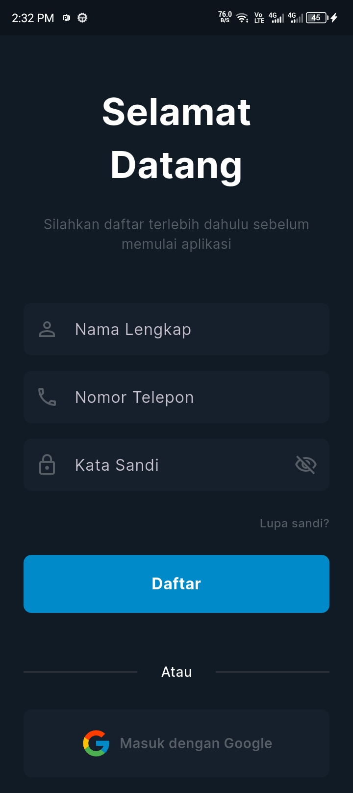

<h1 align="center">SMK EDU MANAGEMENT APP</h1>

## Screenshoots

<div align="center">






</div>

## Fitur

|       Fitur        | Status |
| :----------------: | :----: |
| Mengirimkan tugas  |   ❌   |
| Mengumpulkan tugas |   ❌   |

## Teknologi yang Digunakan

- Frontend: [Flutter](https://flutter.dev/ "Flutter") (WIP)
- Backend: [Node.js](https://nodejs.org) (WIP)
- Database: [MySQL](https://dev.mysql.com/) (WIP)

## Struktur projek

## Instalasi

1. Clone repository

```sh
git clone https://github.com/arsa24/skema.git
```

2. Install dependensi

```sh
cd skema/smk_edu_management_app
flutter pub get
```

3. Jalankan projek

```sh
flutter run
```
